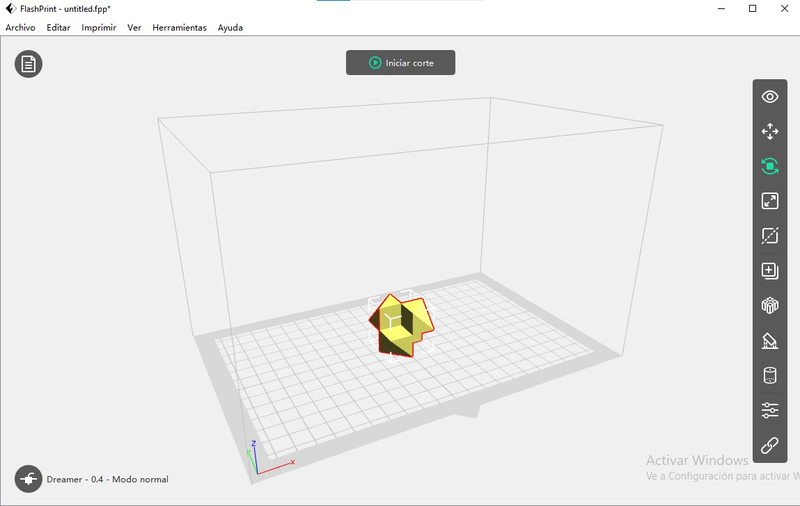

# Preparación de piezas para la impresión

El primer paso es instalar el software de preparación de piezas necesario para la fabricación aditiva de una pieza. Existen diversos tipos de software para esta tarea, cada uno con distintas características. Algunos son más específicos, mientras que otros son más sencillos e intuitivos. Algunos ejemplos de estos programas son Ultimaker cura, Prusaslicer, Repetier host, Flashprint entre otros.

En este caso, utilice Flashprint para preparar las pieza para la impresión pero la lógica utilizada se podría aplicar en cualquier software, siempre teniendo en cuenta las herramientas, ventajas y desventajas de cada uno de ellos.

## Pieza 2

<figure><figcaption>
Primero se debe abrir el programa y cargar un archivo. Para eso se debe dirigir a la parte superior izquierda y seleccionar en archivo/cargar archivo.
</figcaption></figure>

<figure><figcaption>
Luego, en la parte superior hay un botón que indica iniciar corte, en donde van a estar las opciones de edición de la pieza. En el lateral se encuentran otras herramientas que se utilizan para mover la pieza, girarla, escalarla, agregarle soporte, entre otros.
</figcaption></figure>

<figure><figcaption>
Cuando se hace click en el botón de iniciar corte aparece la siguiente ventana. En la parte de impresora lo que se configuro fue la temperatura de la extrusora (190°) y la temperatura de la cama (60°), las cuales son las adecuadas para el tipo de impresora que utilice.
</figcaption></figure>

<figure><figcaption>
En sección de general lo que se reviso es la altura de capa de la impresión, esta se encontraba en 0,18mm y decidí dejarlo en el mismo valor ya que no necesitábamos tanta precisión en la pieza. Cuanto menor sea el numero, mas precisión va a tener la pieza al momento de imprimirse y viceversa. En esta pestaña también se pueden llegar a cambiar algunos de los valores de la velocidad de impresión, pero eso va a depender del modelo y a lo que se quiera llegar. 
</figcaption></figure>

<figure><figcaption>
En la sección de rellenos cambie el relleno por uno el de triangulo.
</figcaption></figure>

<figure><figcaption>
Luego, utilizando una de las herramientas de los laterales llamadas soportes, se le agrego soportes de tipo "arbol".
</figcaption></figure>

<figure><figcaption>
Luego, se hace click en el botón que indica vista previa de corte para poder visualizar como se va a llevar a cabo la impresión, tiempo de demora, entre otros datos.
</figcaption></figure>

<figure><figcaption>
Así se visualiza la información nombrada anteriormente, también se puede ver el recorrido de la extrusora y las capaz de impresión.
</figcaption></figure>

<figure><figcaption>
Para salir de la vista previa, se debe hacer click en el boton de cerrar vista previa.
</figcaption></figure>

<figure><figcaption>
Por ultimo, se guarda el archivo en el lugar de destino y se lleva a la impresora.
</figcaption></figure>

## Pieza 1

<figure><figcaption>
Así quedo preparada la pieza 1, se le agrego soportes lineales.
</figcaption></figure>

## Pieza 3

<figure><figcaption>
Así quedo preparada la pieza 3.
</figcaption></figure>
